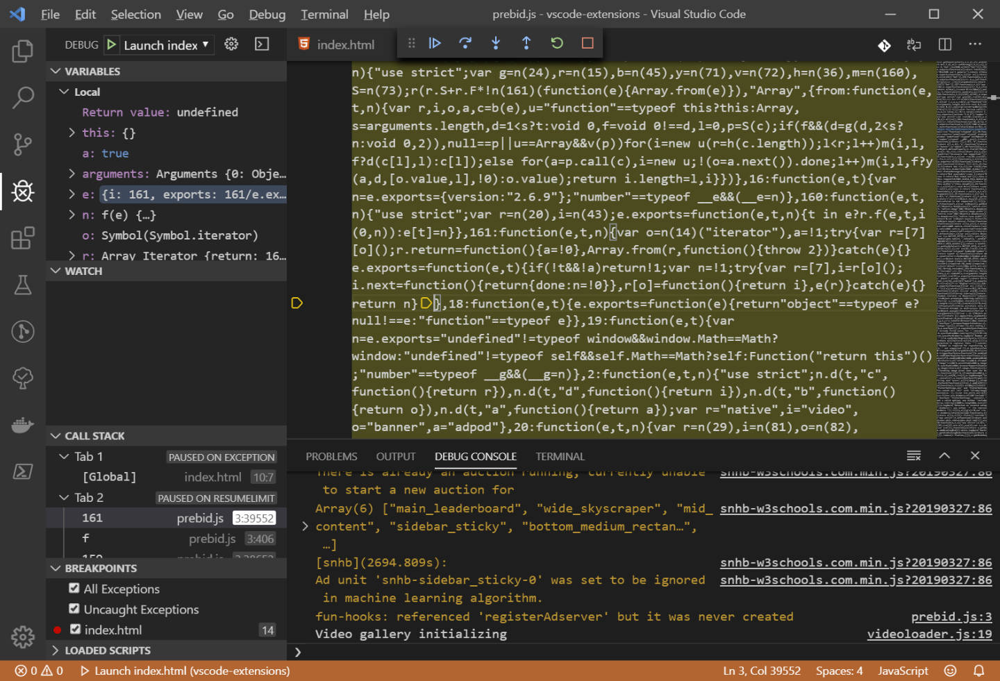

# [Debugger for Firefox VSCode Extension](<https://chocolatey.org/packages/vscode-firefox-debug>)

A VS Code extension to debug web applications and extensions running in the [Mozilla Firefox browser](https://www.mozilla.org/en-US/firefox/developer/?utm_medium=vscode_extension&utm_source=devtools).

## Features

* Pause [breakpoints](https://code.visualstudio.com/docs/editor/debugging#_breakpoints), including advanced [conditional](https://code.visualstudio.com/docs/editor/debugging#_conditional-breakpoints) and [inline](https://code.visualstudio.com/docs/editor/debugging#_inline-breakpoints) modes
* Inject logging during debugging using [logpoints](https://code.visualstudio.com/docs/editor/debugging#_logpoints)
* Debugging eval scripts, script tags, and scripts that are added dynamically and/or source mapped
* Variables pane for inspecting and setting values
* Watch pane for evaluating and watching expressions
* Console for logging and REPL
* Debugging Firefox extensions
* Debugging Web Workers
* Compatible with [remote development](https://code.visualstudio.com/docs/remote/remote-overview)
* Pause on object property changes with [Data breakpoints](https://code.visualstudio.com/docs/editor/debugging#_data-breakpoints) (Works with Firefox 70)
* Use VS Code's (new UI for column breakpoints)[https://code.visualstudio.com/updates/v1_39#_improved-ui-for-column-breakpoints]

## Notes

* This package requires Visual Studio Code 1.39.0 or newer.
  You can install either the [vscode](https://chocolatey.org/packages/vscode) or [vscode-insiders](https://chocolatey.org/packages/vscode-insiders) package.
* The extension will be installed in all editions of Visual Studio Code which can be found.
* While this package installs a specific version of the extension, Visual Studio Code by default will update the extension to the latest version on startup if there's a newer version available on the marketplace.
  See [Extension auto-update](https://code.visualstudio.com/docs/editor/extension-gallery#_extension-autoupdate) for instructions on how to disable auto-update.
* This package is automatically updated using the [Chocolatey Automatic Package Update Model (AU)](https://github.com/majkinetor/au/blob/master/README.md).
  If you find it is out of date by more than a day or two, please contact the maintainer(s) and let them know the package is no longer updating correctly.

